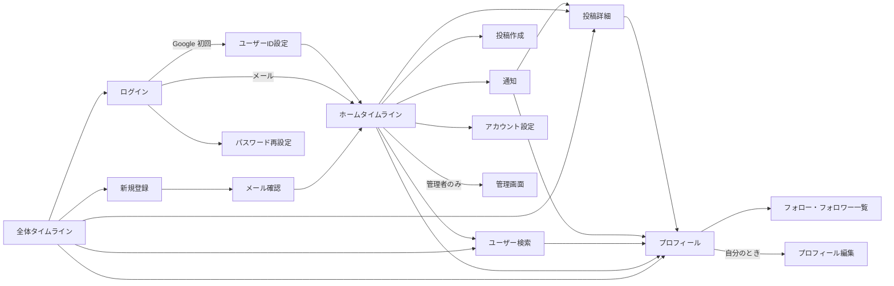

# 画面一覧と画面遷移

[目次に戻る](README.md)

| 画面 | パス | ログイン | 概要 |
| --- | --- | --- | --- |
| 全体タイムライン | `/` | 不要 | 未ログイン時のトップ。ログイン済みならホームへ切り替えられる |
| ホームタイムライン | `/home` | 必要 | 自分とフォロー中の投稿 |
| ログイン | `/login` | 不要 | メール＋パスワード（Google ログインは Could） |
| 新規登録 | `/signup` | 不要 | 登録フォーム、規約への同意 |
| メール確認 | `/verify-email` | 不要 | 確認リンクの着地ページ（Could。MVP では作らない） |
| パスワード再設定 | `/password-reset` | 不要 | 再設定メールの送信、新しいパスワードの入力（Could。MVP では作らない） |
| ユーザーID設定 | `/onboarding` | 必要 | Google で初回登録したときのユーザーID設定（Could。MVP では作らない） |
| 投稿作成 | （モーダル） | 必要 | テキストと画像 4 枚まで |
| 投稿詳細 | `/posts/:id` | 不要 | 本文、画像、コメントスレッド |
| プロフィール | `/users/:handle` | 不要 | 投稿一覧、フォロー・フォロワー |
| ユーザー検索 | `/search?q=` | 不要 | ユーザーID・表示名で検索 |
| フォロー・フォロワー一覧 | `/users/:handle/following` `/users/:handle/followers` | 不要 | |
| プロフィール編集 | `/settings/profile` | 必要 | アイコン、表示名、自己紹介 |
| アカウント設定 | `/settings/account` | 必要 | パスワード変更、ブロック一覧、退会（Could。MVP では作らない） |
| 通知 | `/notifications` | 必要 | 通知一覧 |
| 管理画面 | `/admin/reports` | 管理者 | 通報一覧と対応（Could。MVP では作らない） |

