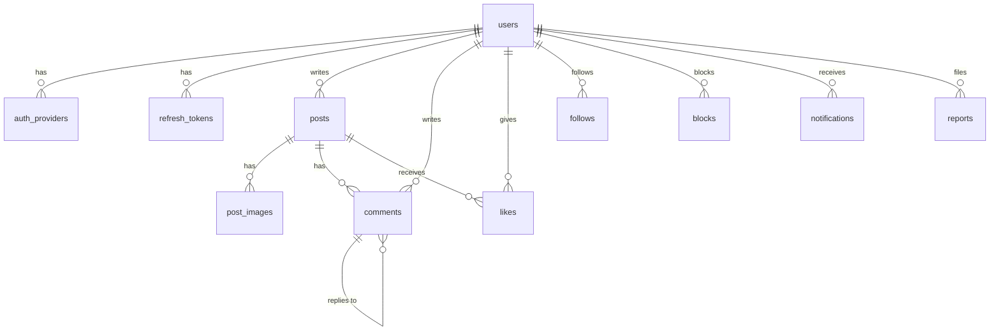

# データモデル

[目次に戻る](README.md)

| テーブル | 主な項目 | 制約・インデックス |
| --- | --- | --- |
| users | id, email, password_hash（NULL 可）, email_verified_at, handle, display_name, bio, avatar_key, role（USER / ADMIN）, status（ACTIVE / SUSPENDED）, created_at | email・handle は一意。handle・display_name に部分一致検索用の GIN インデックス（pg_trgm） |
| auth_providers | id, user_id, provider（GOOGLE）, provider_user_id, created_at | (provider, provider_user_id) で一意 |
| refresh_tokens | id, user_id, token_hash, expires_at, revoked_at, created_at | token_hash で一意 |
| email_verifications | id, user_id, token_hash, expires_at, used_at | |
| password_resets | id, user_id, token_hash, expires_at, used_at | |
| posts | id, user_id, body, created_at | (user_id, created_at DESC)、(created_at DESC) |
| post_images | id, post_id, original_key, thumbnail_key, width, height, sort_order | 1 投稿につき 4 件まで |
| comments | id, post_id, user_id, parent_id（NULL 可）, body, deleted_at, created_at | (post_id, created_at)、(parent_id) |
| likes | user_id, post_id, created_at | (user_id, post_id) が主キー |
| follows | follower_id, followee_id, created_at | (follower_id, followee_id) が主キー。自分自身は不可 |
| blocks | blocker_id, blocked_id, created_at | (blocker_id, blocked_id) が主キー |
| notifications | id, recipient_id, actor_id, type（LIKE / COMMENT / REPLY / FOLLOW）, post_id, comment_id, read_at, created_at | (recipient_id, created_at DESC) |
| reports | id, reporter_id, target_type（POST / COMMENT / USER）, target_id, reason, detail, status（OPEN / RESOLVED / REJECTED）, created_at | (status, created_at) |
| mutes（Should） | muter_id, muted_id, created_at | (muter_id, muted_id) が主キー |

- id は時系列順に並ぶ UUIDv7 とし、カーソル方式のページングにそのまま使う
- スキーマの変更は Flyway のマイグレーションで管理する
